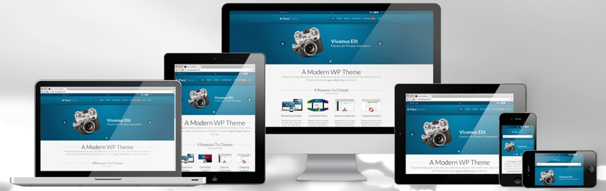
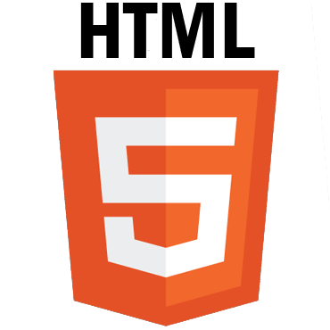
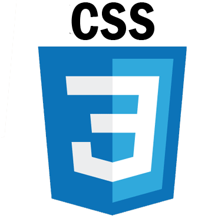
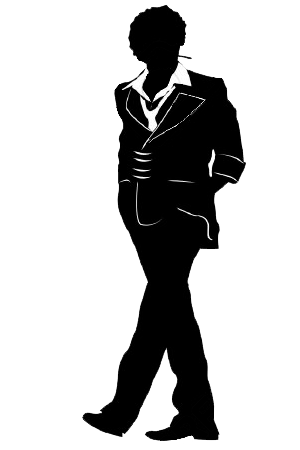
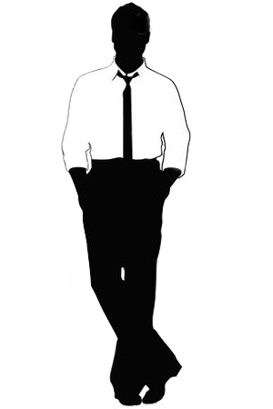
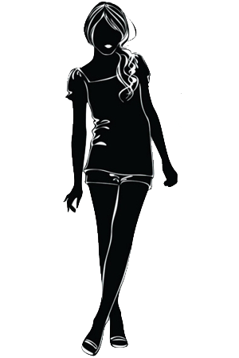
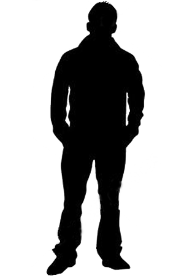

<!doctype html>
<html lang="en">
  <head>
    <!-- Required meta tags -->
    <meta charset="utf-8">
    <meta name="author" content="SergiuszDef">
    <meta http-equiv="content-language" content="ru">
  <meta name="viewport" content="width=device-width, initial-scale=1.0">
    <meta name="keywords" content="">
    <meta name="description" content="">
    <link rel="shortcut icon" type="image/x-icon" href="/favicon.ico">
    <!-- Bootstrap CSS -->
    <link href="https://fonts.googleapis.com/css?family=Exo+2" rel="stylesheet"> 
    <link href="https://fonts.googleapis.com/css?family=Exo+2|Open+Sans" rel="stylesheet"> 
    
    <link rel="stylesheet" href="https://maxcdn.bootstrapcdn.com/bootstrap/4.0.0-beta.3/css/bootstrap.min.css" integrity="sha384-Zug+QiDoJOrZ5t4lssLdxGhVrurbmBWopoEl+M6BdEfwnCJZtKxi1KgxUyJq13dy" crossorigin="anonymous">
    <link rel="stylesheet" type="text/css" href="style/animate.min.css">
    <link rel='stylesheet' href='style/style.css'>
    <link rel='stylesheet' media='only screen and (max-width: 600px)' href="style/600.css">
    <link rel='stylesheet' media='only screen and (max-width: 950px) and (min-width: 600px)' href="style/1000.css">
    <!-- FONT -->
    <title>Разработка и продажа сайтов</title>
  </head>
  <body>
    

  

    

      
      
      
    

    
  

  

    
  

  

    

        
        
8(915) 390-99-15

    

    
Позвонить нам

    
Позвонить на WhatsAppp

  

  

    

      
      
8(495) 160-57-29

    

      
Заказать обратный звонок

  

<nav class="modal_form" id="mod_form">
  
  <form>
    

       
Заказать обратный звонок

    

    <ul class="form">
      <li>
        <label for="alias">Как к Вам обращаться:</label>
        <input type="text" name="alias" class="elem_form elem_field">
      </li>
      <li>
        <label for="phone_number">Ваш номер:</label>
        <input type="text" name="phone_number" class="elem_form elem_field">
      </li>
      <li>
        <button type="button" class="btn btn-lg elem_form elem_button">Отправить</button>
      </li>
      <li>
        <label for="che"><input type="checkbox" checked name="agreement" id="che"> согласие на обработку персональных данных</label>
      </li>
      <li>
        <a href="">Политика конфиденциальности</a>
      </li>
    </ul>
  </form>
</nav>
    <header id="hed">
      

      

        <nav id="menu_point" class="col-md-12">
          
<a href="index.php">Главная</a>

          
<a href="../pages/amenities.php">Услуги</a>

          
<a href="../pages/portfolio.php">Портфолио</a>

          
<a href="../pages/blog.php">Блог</a>

          
<a href="../pages/contacts.php">Контакты</a>

          

            
            
            
            
          

        </nav>
      

    

    </header>

  <ol class="carousel-indicators">
    <li data-target="#carouselExampleIndicators" data-slide-to="0" class="active"></li>
    <li data-target="#carouselExampleIndicators" data-slide-to="1"></li>
    <li data-target="#carouselExampleIndicators" data-slide-to="2"></li>
  </ol>
  

    

      
    

    

      
    

    

      
    

  

  <a class="carousel-control-prev" href="#carouselExampleIndicators" role="button" data-slide="prev">
    
    Previous
  </a>
  <a class="carousel-control-next" href="#carouselExampleIndicators" role="button" data-slide="next">
    
    Next
  </a>

  

    

      <h3 class="text_min">
        Какой сайт нужен
         
        Вам?
      </h3>
    

    

      

        

          
Вы являетесь частным предпренимателем и Вам нужен небольшой, но информативный сайт? Возможно Вам нужен “Сайт визитка”

          Поробнее
        

        

          
Вы являетесь небольшой компанией, которая предоставляет товары и услуги, и Вы хотете, иметь на Вашем сайте каталог стоварами и услугами? Вам подходит “Корпоративный бизнес сайт”

          Поробнее
        

        

          
Возможно Ваша компания крупная и насчитывает больше сотни сотрудников, в таком случае будет очень полезен "Внутренний корпоративный сайт"

          Поробнее
        

      

      

        

          
        

        

          <h6>Сайт-визитка</h6>
            
          

            
Сайт-визитка – обычно состоит из одной или нескольких страниц и имеет уникальный, но простой и функциональный дизайн;

            
Иеально подходит для компаний, которые хотят разместить информацию о себе и своих услугах в Интернете;

            
основные разделы сайта: «О компании», «Продукция или услуги», «Прайс-листы», «Контактная информация»;

            
Такой сайт используется предприятиями, организациями и частными лицами.

            Вернуть все статьи
          

        

        

          <h6>Бизнес сайт</h6>
            
          

            
Корпоративный имиджевый web сайт – идеально подходит для обеспечения имиджевого присутствия в Сети;

            
Cайт служит для предоставления подробной информации о компании, истории торговой марки, сведений об оказываемых услугах или поставляемых товарах;
 
            
Корпоративный сайт обычно содержит ленту новостей компании, средства публикации информации о рекламных и торговых акциях, информацию для прессы и другие сведения;

            
Часто такие сайты сочетают информацию о компании с каталогом продукции;

            
Используется эксклюзивный оригинальный дизайн, выгодно представляющий компанию; использование нестандартных идей и решений в оформлении, процентное соотношение текст/графика = 50/50

            Вернуть все статьи
          

        

        

          <h6>Корпоративный сайт</h6>
            
          

            
Корпоративный информационный сайт – необходим для автоматизации внутреннего документооборота, учёта показателей компании, управления персоналом, может быть оснащён функциями обмена информацией между удалёнными филиалами; корпоративный сайт позитивно влияет на репутацию и имидж компании; дизайн должен соответствовать фирменному стилю компании; чаще всего, включает «администраторскую часть» для создания и изменения контента, позволяющую менеджеру или секретарю компании добавлять или менять новости, информационные статьи, справочную и прочую информацию на сайте; используется минимум графики, основной упор идет на текст.

            Вернуть все статьи
          

        

        

          <h6>Информационный контент-проект</h6>
            
          

            
Информационный контент-проект – это сайт, как правило некоммерческой неправленности, который представляет собой собрание текстов, статей и прочих материалов, основная задача которого – привлечение посетителей по определенной тематике. Часто, этот трафик обычно перенаправляется на коммерческие сайты и, по сути, контент-проект используется, как рекламная площадка.

            
Может быть выполнен в виде интернет-библиотеки, энциклопедии или справочника. Каждая отдельная страничка сайта контент-проекта дает, как правило, незначительный трафик, однако общий трафик такого сайта может быть очень внушительным.

            
Также может представлять собой образовательный или развлекательный ресурс.

            
 Может предстовлять из себя большой виртуальный массив информации, включающий в себя множество различных тематических разделов меньшего размера, либо некоторое количество самостоятельных проектов.

            Вернуть все статьи
          

        

        

          <h6>Интернет-магазин</h6>
            
          

            
Интернет-магазин, он же Сетевой магазин, Электронный магазин, Internet shop, E-shop – интерактивный веб-сайт рекламирующий товар или услугу, принимающий заказы на покупку, предлагающий пользователю выбор варианта расчета, выписывающий счет на оплату, служащий одновременно подтверждением заказа;
 
            
при этом администратор магазина обязан: организовать доставку товара;

            
проконтролировать расчеты с покупателем за поставку.

            Вернуть все статьи
          

        

        

          <h6>Блог</h6>
            
          

            
Блог – это сайт, представляющий собой интернет-дневник, или журнал, который ведется наподобие новостной ленты, при этом на каждую тему блога посетители могут оставлять свои комментарии-сообщения, доступные с главной страницы соответствующей темы. Блог обычно очень часто обновляется, по этой причине он может намного чаще индексироваться поисковыми машинами, чем обычные сайты.

            
Блог часто используется для общения людей объединенных какими-либо общими интересами, и в этом, чем-то, напоминает форум.

            
Самые последние события в мире зачастую раньше появляются на различных блогах, и только немного позже в сообщениях новостных интернет-изданий.

            
В общем можно говорить о том, что блог представляет собой странный гибрид ленты новостей, гостевой книги и форума одновременно.

            Вернуть все статьи
          

       

      

      

        

          
Занимаитесь обучением, нужен информационный блог  для обучающихся или просто необходимо привлеч нужную аудиторию - стоит расмотреть "Информационный сайт" или "Контент-проект"

          Поробнее
        

        

          
Вам нужен полноценный онлайн магазин на котором будут распологаться множество товаров?

          Поробнее
        

        

          
Вы талантливы и Вам есть о чём сказать!? Возможно Вам нужен персональный блог.

          Поробнее
        

      

    

  

  

    

    

      

        
Работаем

        
БЕЗ переплаты

      

      

        
Более года

        
успешной работы

      

      

        
Более 2

        
крупных проектов

      

    

  

  

  

    <h3 class="headerFormat3">Почему именно мы?</h3>
  

  

    

      

        <h3>НАШИ ПРИЕМУЩЕСТВА</h3>
      

      

        
Студия WEB-разработки D\S - это команда профессионалов которая ответственно и креативно подойдет к реализации задач поставленных перед нами! Многие годы работы, множество восторженных клиентов, а так же большое портфолио говорят сами за себя!

      

    

  

  <h3>Технологии с которыми мы работаем</h3>
  

    

      
    

    

          
    

    

      
    

    

      
    

    

      
    

  

  <content class="whyWe">
    <h3 class="headerFormat3">Процесс выполнения заказа</h3>
    

      

        

          <h2>Разработка технического задания</h2>
          
Первым этапом создания сайта будет разработка индивидуального адаптивного макета и представление его на утверждение.​

        

        

          

        

        

          
        

      

    

    

      

        

          
        

        

          

        

        

          <h2>Разработка макета</h2>
          
Первым этапом создания сайта будет разработка индивидуального адаптивного макета и представление его на утверждение.​

        

      

    

    

      

        

          <h2>Написание кода</h2>
          
Процесс создания готового сайта может занять от несколько дней до месяца, в зависимости от сложности проекта.​

        

        

          

        

        

          
        

      

    

    

      

        

          
        

        

          

        

        

          <h2>Тестирование сайта</h2>
          
Проверка ресурса на адаптивность, кросбраузирность, риливантность поисковых систем, тестирование готового кода.

        

      

    

  </content>

<nav class="consultchen">
    <form action="">
      <label for="">Как к Вам обратиться</iebel>
      <input type="text" name="" id="">
      <label for="">Номер телефона</iebel>
      <input type="text" name="" id="">
      <button></button>
      <label for="">
        <input type="checkbox" checked name=""> согласие на обработку персональных данных
      </label>
      
Оставти ваш номер телефона и нашь специолист неприменно с Вами свяжется

    </form>
  </nav>
<footer class="foot">
  

    

      

        <h2>Делаем сайт адаптивным со скидкой до 20%</h2>
  
Когда сайт адаптирован под мобильные устройства, это напрямую сказывается на количестве заказов. Если клиентам удобно пользоваться, они будут с вами.

  
Мы делаем быстрые, адаптивные сайты, которые отлично выглядят на всех устройствах и дружат с поисковыми системами.​

  

    Бесплатная консультация
  

    

  

  

  

        
      

      

        
      

      

        
      

      

        
      

      

        
      

      

        
      

      

        
      

    

        
      

       

        
      

       

        
      

   <a href="pages/privacy_policy.php" class="map_policy">Политика конфиденциальности</a>
   <a href="pages/site_map.php" class="map_policy">Карта сайта</a>
</footer>
    

  </body>
</html>
